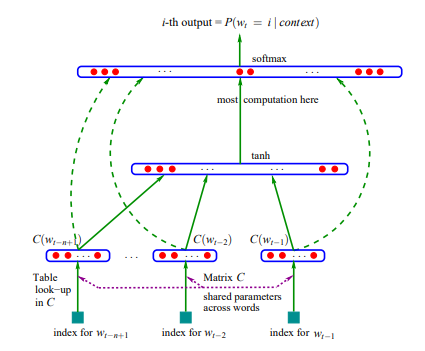

MLP model based on <a href="[def]"> Bengio et al. 2003</a> and <a href="https://karpathy.ai/">karpathy's</a> <a href="https://www.youtube.com/watch?v=TCH_1BHY58I&t=1107s">explanation</a> and implementation.

## About Model
This MLP model uses a context length (e.g 3, 4) for predicting the next character.  
The idea comes from the above paper in which three words are used for predicting the next word. Here we'll use 3 letters for predicting the next one. 
MLP model has one hidden layer (with 200 neurons for this example) and uses tanh as activation function. 
We use a table look-up called C for changing each letter to a different dimension (for this model 2), So each letter of train/val/test will be changed to an arbitrary dim vector then fed to the model. 
At the last layer (The 27 alphabetical word suggested for the next character) the nodes will go through softmax function.

[def]: hrome-extension://efaidnbmnnnibpcajpcglclefindmkaj/https://www.jmlr.org/papers/volume3/bengio03a/bengio03a.pd