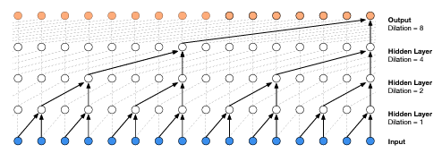

The Wavenet implementation of the previous model. The code and explanation comes from <a href="https://www.youtube.com/watch?v=t3YJ5hKiMQ0">andrej karpathy</a> based on the <a href="https://arxiv.org/abs/1609.03499">Wavenet 2016</a> paper.  

## About Model
This model uses wavenet in forward pass by not letting all letters to combine in a single layer instead allowing them to couple in each step and combine at the end layers as shown below:

