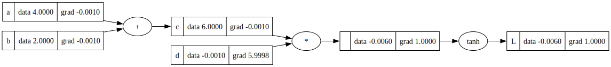
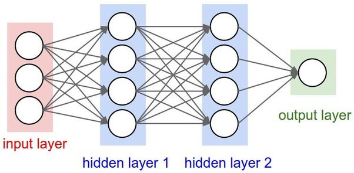

A simple implementation of Neural network including both forward pass and backward pass. Tracking the values and gradients of each operation inside the neurons. Most of the idea and the code comes from <a href="https://github.com/karpathy/micrograd/tree/master">micrograd</a>. <br />

With the help of Track class you track the gradients and operation. You can also draw a plot for more simplification. Below code is a sample representation :

```python

a = Track(4, label="a")
b = Track(2, label="b")
c = a + b ; c.label="c"
d = Track(-0.001, label="d")
e = c * d
L = e.tanh(); L.label="L"; L.grad = 1

L.backward()
L.draw_dot()

```




Also for MLPS you can use below code:

```python

x = [2.0, 3.0, -1.0]
n = MLP(3, [4, 4, 1])
n(x)

```

which is equivalent to below MLP: 



Also train your model for a given sample data:

```python

xs = [
    [2.0, 3.0, -1.0],
    [3.0, -1.0, 0.5],
    [0.5, 1.0, 1.0],
    [1.0, 1.0, -1.0]
]

ys = [1.0, -1.0, -1.0, 1.0]
ypred = [n(x) for x in xs]
ypred


for k in range(10):
    # forward pass
    ypred = [n(x) for x in xs] 
    loss = sum((yout - ygt)**2 for ygt, yout in zip(ys, ypred))
    
    # backward pass
    for p in n.parameters():
        p.grad = 0.0
    loss.backward()
    
    for p in n.parameters():
        p.data += -0.05 * p.grad
        
    print(k, loss.data)

# output: 
# 0 7.569377390974984
# 1 6.768385957408608
# 2 5.515120803251046
# 3 3.2038140846055927
# 4 2.0937048633550726
# 5 1.4022823090321372
# 6 0.8760101801552147
# 7 0.5645550243370756
# 8 0.39118267699299625
# 9 0.28952836453745523
```