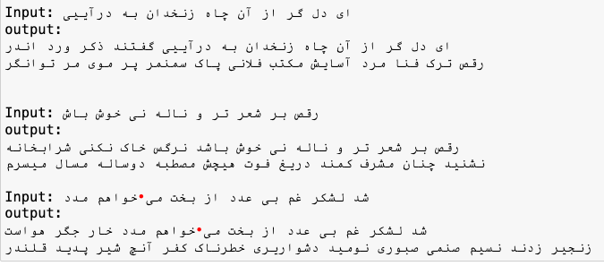

# Persian Poetry Generation with Transformer-based Model

## Overview

This project aims to generate Persian poetry inspired by the works of Hafez Shirazi using a Transformer-based model.<br /> The main objective is to create a model that can generate coherent and rhyming verses, maintaining the style and structure characteristic of classical Persian poetry.

## Project Structure

### 1. Dataset Preparation

I used a dataset of Hafez's poems for training the model. The text was preprocessed to replace line breaks with special tokens and padded to ensure uniform sequence lengths. This preprocessing step helps the model understand the structure of the verses and maintain consistency in the generated poetry.

### 2. Tokenization

I employed the Byte-Level BPE (Byte Pair Encoding) tokenizer to handle the Persian text efficiently. This tokenizer helps in breaking down the text into subwords, which are more manageable for the model to learn and generate.

### 3. Embeddings

To capture the semantic meanings of the words, we used FastText embeddings. These embeddings were pre-trained on a large Persian corpus and then integrated into our model. The use of pre-trained embeddings helps the model understand the relationships between words better, even with a limited dataset.

### 4. Model Architecture

My model is based on the Transformer architecture, specifically a decoder-only Transformer. The key components include:

- **Positional Encoding**: To provide information about the position of each token in the sequence.
- **Multi-Head Attention**: To allow the model to focus on different parts of the sequence simultaneously.
- **Feed-Forward Network**: To process the attention outputs.
- **Layer Normalization and Dropout**: To stabilize and regularize the training process.

### 5. Custom Loss Function

To ensure the generated poetry maintains the rhyming structure, I implemented a custom loss function that penalizes the model if the endings of corresponding verses do not rhyme. This additional loss term encourages the model to learn and generate rhyming patterns characteristic of Hafez's poetry.

### 6. Training and Validation

The model was trained using a combination of base loss (CrossEntropy) and the custom rhyme loss. I also implemented early stopping to prevent overfitting. The training loop was designed to monitor both training and validation losses, ensuring the model's performance improves over time.

### 7. Text Generation

For generating poetry, I implemented a function that uses top-k sampling and a repetition penalty. The repetition penalty helps in reducing the occurrence of repeated words, ensuring the generated verses are more diverse and meaningful.

## Challenges

1. **Maintaining Rhyming Structure**: Ensuring the model generates rhyming verses was challenging. This was tackled by adding a custom rhyme loss to the training process.
2. **Limited Dataset**: The dataset of Hafez's poetry is relatively small, which can limit the model's ability to generalize. Using pre-trained FastText embeddings helped mitigate this issue.

## Future Directions

1. **Data Augmentation**: Expanding the dataset with more Persian poetry to improve the model's generalization.
2. **Fine-Tuning**: Experimenting with different model architectures and hyperparameters to enhance performance.
3. **Interactive Applications**: Developing interactive tools or applications that allow users to generate and explore Persian poetry.

## Prerequisites

Before running the code, ensure you have the following installed:
1. **Python** (>= 3.7)
2. **PyTorch** (>= 1.8)
3. **Tokenizers** (>= 0.10)
4. **FastText**:
   - You need to download the FastText model for Persian. Use the following command to download it:
     ```bash
     wget https://dl.fbaipublicfiles.com/fasttext/vectors-crawl/cc.fa.300.vec.gz
     gunzip cc.fa.300.vec.gz
     ```
   - Ensure the `cc.fa.300.vec` file is placed in the correct directory as specified in the code.

## Outputs
